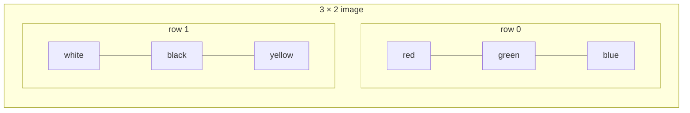
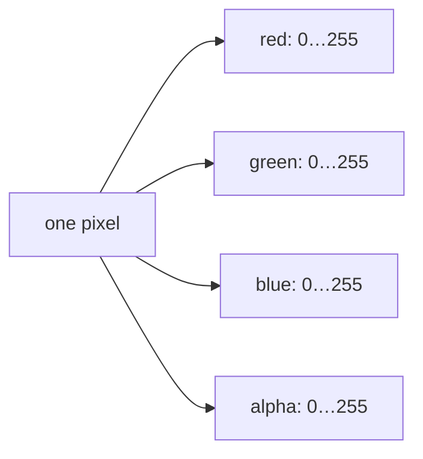
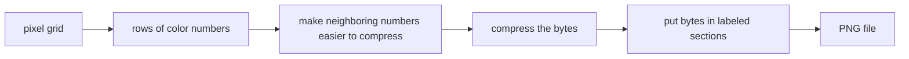

# Start Here: An Image Is a Grid of Numbers

You do not need to know image formats, compression, binary arithmetic, or computer graphics before
reading this book. We will begin with what you can see and add one idea at a time.

## First idea: an image is a grid

Imagine a tiny image that is three squares wide and two squares tall:



Each square is a **pixel**. A pixel is simply one position in the grid. We identify it with two
numbers:

- `x`: how far from the left;
- `y`: how far from the top.

Both start at zero. The green pixel above is `(1, 0)`. The yellow pixel is `(2, 1)`.

## Second idea: a color is also numbers

A screen usually builds a color by mixing red, green, and blue light. We store the amount of each
light as a number from 0 to 255.

| Color | Red | Green | Blue |
|---|---:|---:|---:|
| black | 0 | 0 | 0 |
| white | 255 | 255 | 255 |
| red | 255 | 0 | 0 |
| yellow | 255 | 255 | 0 |

One more number, **alpha**, says how opaque the pixel is. Alpha 255 means fully visible. Alpha 0
means fully transparent. The four numbers together are often abbreviated **RGBA**.



## Third idea: files store bytes

A file is a sequence of small numbers called **bytes**. One byte can store a value from 0 to 255,
which is exactly enough for one eight-bit color amount.

Our red opaque pixel can therefore become four bytes:

```text
meaning:   red   green   blue   alpha
decimal:   255      0      0     255
hex:        ff     00     00      ff
```

“Hex” is only another way to write numbers. `ff` means 255 and `00` means 0. You do not need to
memorize hexadecimal now; the next foundations chapter explains it visually.

## Why not save only these four bytes?

A reader would not know:

- whether the file is really an image;
- how wide or tall it is;
- whether each pixel uses RGB, grayscale, or a palette;
- whether the color numbers were compressed;
- whether transmission damaged a byte.

PNG adds small labeled sections that answer those questions. The complete journey is:



Decoding walks through the same boxes from right to left.

## Five words to remember for now

- **pixel**: one position in an image grid;
- **channel**: one color component, such as red or alpha;
- **byte**: a stored number from 0 to 255;
- **encode**: turn an image into file bytes;
- **decode**: turn file bytes back into an image.

Everything else is introduced when we need it. Continue with [Why build PNG?](01-purpose.md), or
keep the [glossary](03-glossary.md) open if you prefer to look up terms immediately.

