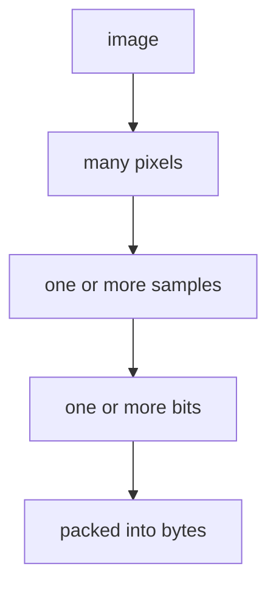

# Glossary in Plain Language

This page is a safety net, not required reading. Each chapter explains its own new terms first.

| Term | Plain-language meaning |
|---|---|
| alpha | A number describing opacity: whether a pixel is solid, transparent, or between. |
| ancillary chunk | Optional information that is not required to reconstruct pixels. |
| big-endian | Writing the largest part of a multi-byte number first. |
| bit | One binary choice, written as 0 or 1. Eight bits usually form one byte. |
| bit depth | How many bits are used for one color value. More bits allow more distinct values. |
| byte | A stored number made from eight bits, normally interpreted as 0 through 255. |
| channel | One component of a pixel, such as red, green, blue, or alpha. |
| chunk | One labeled PNG section containing length, name, data, and an integrity check. |
| color type | The PNG rule saying which channels each pixel stores. |
| compression | Rewriting data so it takes fewer bytes while retaining all information. |
| CRC | A number calculated from chunk bytes to detect accidental corruption. |
| critical chunk | A chunk whose meaning is required to reconstruct the image. |
| datastream | The ordered bytes that make up one complete PNG. In this book, usually “PNG file.” |
| decode | Convert PNG bytes into pixels and metadata. |
| Deflate | The compression algorithm used inside PNG's zlib stream. |
| encode | Convert pixels and metadata into PNG bytes. |
| filter | A reversible row transformation that makes values easier to compress. |
| grayscale | A pixel represented only by brightness, rather than separate RGB amounts. |
| hexadecimal | Base-16 number notation. One byte is written from `00` through `ff`. |
| IDAT | The PNG chunk carrying compressed rows. Multiple consecutive IDAT chunks form one stream. |
| IHDR | The first PNG chunk, containing width, height, color type, and related basics. |
| interlace | Storing sparse passes so a rough version of the image can appear progressively. |
| metadata | Information about an image besides its pixels, such as text or physical density. |
| network byte order | Another name for big-endian byte order. |
| packed sample | Several small color or palette values sharing one byte. |
| palette | A numbered color table. A pixel stores a table index instead of RGB directly. |
| pixel | One position in a rectangular image grid. |
| predictor | A guess based on neighboring bytes; a PNG filter stores the difference from it. |
| raster | All pixels of an image arranged in rows. |
| sample | One stored numeric value, such as a red amount, brightness, alpha, or palette index. |
| scanline | One horizontal row in the encoded image. |
| signature | PNG's fixed first eight bytes, used to recognize the format. |
| stream | Bytes read or written in order, without requiring all bytes at once. |
| tRNS | A PNG chunk adding simple transparency to formats without an alpha channel. |
| zlib | The wrapper around compressed Deflate data used by PNG IDAT. |

## Similar words that are not identical

A pixel is a location. A sample is one number belonging to that location. A byte is storage. For
RGBA8, one pixel has four samples and those samples happen to occupy four bytes. That convenient
relationship is not true for every PNG color type.

