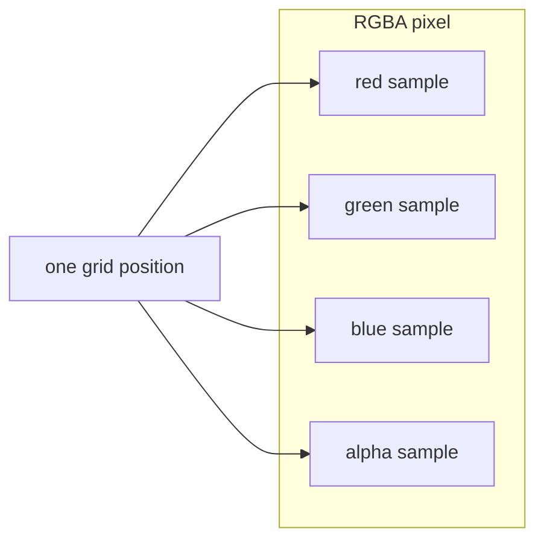
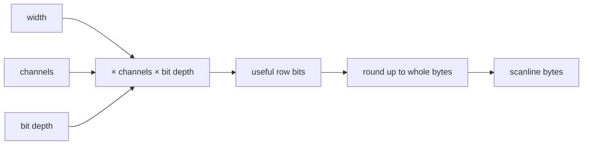

# Pixels, Samples, and Scanlines

## Goal

Build enough image vocabulary to calculate the exact number of bytes in an uncompressed row.

## New words in this chapter

- **pixel**: one position in the rectangular image;
- **sample**: one number belonging to a pixel, such as its red amount;
- **channel**: the meaning of a sample, such as red or alpha;
- **scanline**: one horizontal row prepared for PNG encoding;
- **bit depth**: the number of binary digits used for one sample.

An image is a rectangular grid of **pixels**. A pixel is a location, not necessarily four bytes.
PNG stores one or more **samples** per pixel. A grayscale pixel has one sample; truecolor has red,
green, and blue samples; alpha-bearing variants add an opacity sample.



The five PNG color types are defined in
[PNG §6.1](https://www.w3.org/TR/png-3/#6Colour-values):

| Code | Name | Samples per pixel | Legal bit depths |
|---:|---|---:|---|
| 0 | grayscale | 1 | 1, 2, 4, 8, 16 |
| 2 | truecolor | 3 | 8, 16 |
| 3 | indexed-color | 1 palette index | 1, 2, 4, 8 |
| 4 | grayscale + alpha | 2 | 8, 16 |
| 6 | truecolor + alpha | 4 | 8, 16 |

Color type numbers are bit fields historically, but values 1 and 5 are not valid. Do not accept a
number merely because its bits seem meaningful; accept exactly the standardized cases.

## Deriving row size

Let `w` be width, `c` channels, and `d` bit depth. The useful bits are:

```text
bits = w × c × d
```

Every scanline is padded to a whole byte, so use ceiling division:

```text
rowBytes = (bits + 7) / 8
```



For 13 indexed pixels at depth 2, `bits = 26` and `rowBytes = 4`. Six padding bits at the end of
the row are not pixels and must never leak into the next row.

In Scala, widen before multiplying:

```scala
val rowBytes = ((width.toLong * channels * bitDepth + 7) / 8).toInt
```

`width * channels * bitDepth` as `Int` can overflow before assignment to a `Long`.

## Scanlines are not stored alone

Each decompressed scanline begins with one filter-type byte. Therefore a non-interlaced image's
exact inflated size is:

```text
(rowBytes + 1) × height
```

That equality later becomes both a parser invariant and a decompression-bomb limit.

## Checkpoint

Calculate row sizes for:

1. width 1, RGBA8;
2. width 9, grayscale1;
3. width 100, truecolor16.

Answers: 4, 2, and 600 bytes. Then inspect `Header.scanlineBytes` and its overflow check.
