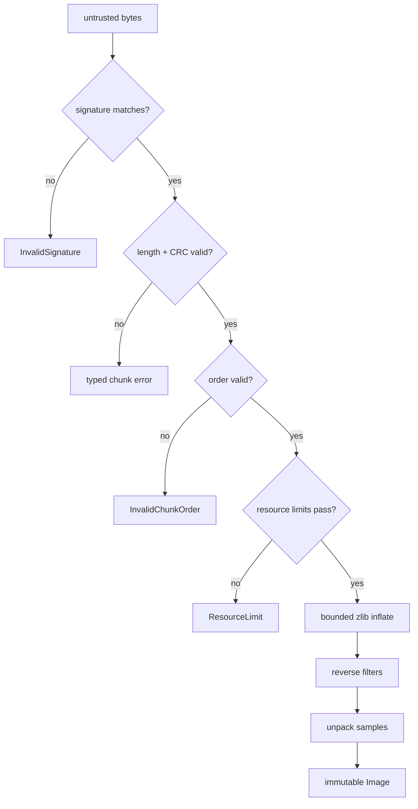

# From Bytes to Pixels

## Goal

Compose validated primitives into a decoder without losing the precision of their errors.

## New words in this chapter

- **validation**: checking a rule before trusting a value;
- **inflate**: restore compressed zlib data to its original bytes;
- **resource limit**: a caller-selected boundary on memory, dimensions, or input size;
- **normalized**: converted from several file representations into one public representation.

The public entry point is [`Png.decode`](https://github.com/ubugeeei/learn-png/blob/main/src/png/Png.scala). It is deliberately a thin
orchestrator. Each stage either produces a stronger value or returns a typed failure:

```text
Array[Byte]
  -> signature-checked cursor
  -> CRC-checked chunks
  -> order-checked datastream
  -> validated Header
  -> bounded inflated scanlines
  -> reconstructed rows
  -> normalized RGBA samples
  -> Image
```



## Validate before allocation

The dangerous order is “read width, allocate width × height, validate later.” The safe order is:

1. enforce a file-byte limit;
2. parse a 13-byte IHDR;
3. validate positive dimensions and legal color/depth pair;
4. widen and calculate pixel count;
5. enforce width, height, and pixel limits;
6. derive exact inflated size and enforce its limit;
7. only then allocate scanline and raster storage.

`DecoderOptions` makes policy explicit. A desktop viewer and avatar upload service should not need
the same limits. A file can be valid PNG and still exceed the caller's acceptable resources.

## Decompression has an exact contract

For non-interlaced images, the expected output is `(rowBytes + 1) × height`. For Adam7 it is the sum
of that expression over non-empty passes. The zlib output stream rejects a byte beyond that bound,
and decoding also rejects early end. Thus both “too much” and “too little” compressed output are
errors.

## Normalize at the boundary

`Samples.decodeRow` handles packed depths, 16-bit samples, palettes, and tRNS, then produces one
public representation: `Vector[Rgba]`. The rest of an application does not need branches for five
PNG color types.

This choice loses low eight bits from 16-bit input. That is appropriate for this codec's declared
RGBA8 public model, but a preservation-oriented editor would instead parameterize `Image` by sample
depth or expose a 16-bit raster.

## File errors belong in the value channel

`Png.read` maps missing files and permissions to `IoFailure`. It first checks `Files.size` against
`maximumFileBytes`, then reads. A truly streaming parser would enforce the limit while reading and
avoid holding the entire compressed file; that is a later architectural milestone, not something
to pretend the array API already provides.

## Exercises

1. Set `maximumPixels` to one less than a known image and assert the complete `ResourceLimit` value.
2. Truncate one byte from the zlib stream while repairing chunk length and CRC. Identify which layer
   reports the failure.
3. Add a `decodeHeader` operation that returns dimensions without inflating IDAT. Decide how much
   chunk validation it must still perform.
