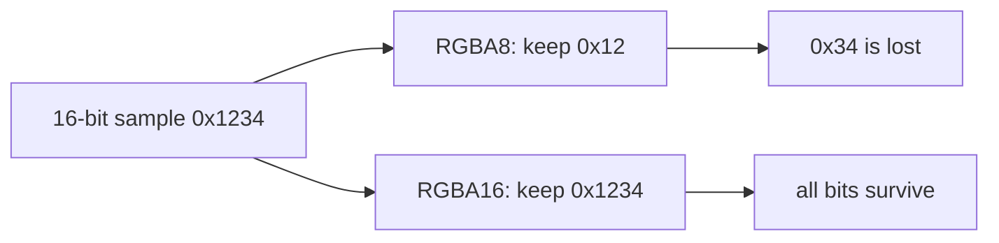

# Keeping All 16 Bits

## The problem with the first raster

The original `Image` stores each channel from 0 to 255. That is enough for an eight-bit PNG, but a
sixteen-bit PNG channel ranges from 0 to 65535. Taking only the high byte changes `0x1234` into
`0x12`; the low byte `0x34` is gone and cannot be reconstructed.



PNG calls itself lossless because its reference-image samples can be recovered exactly. Therefore a
codec that accepts sixteen-bit files needs a public representation capable of returning those bits.

## Two honest APIs

The project exposes two raster levels:

```scala
val displayReady: Either[PngError, Image] = Png.decode(bytes)
val lossless: Either[PngError, Image16] = Png.decode16(bytes)
```

`Image` remains convenient for UI and Java interoperation. `Image16` is appropriate for editing,
scientific values, HDR-related metadata, and lossless transcoding. The names make reduction a caller
choice rather than an invisible decoder side effect.

`Rgba16.toRgba8` uses the high-byte reduction recommended by PNG. Lower-depth inputs expand into
the full sixteen-bit range: eight-bit `0xab` becomes `0xabab`, so converting back recovers `0xab`.

## Encoding

`Png.encode16` emits color type 6 at bit depth 16. Every channel becomes two bytes in network byte
order:

```text
sample 0x1234 -> byte 0x12, then byte 0x34
```

Filtering operates on these serialized bytes with `bpp = 8`. Adam7 gathers `Rgba16` pixels before
serialization and resets filter history for each pass, exactly like the eight-bit path.

## Tests that catch false fidelity

Using values such as `0x0000` and `0xffff` is insufficient: both survive many broken conversions.
Tests deliberately use different high and low bytes—`0x1234`, `0xabcd`, `0x0102`, `0xfedc`—and
compare the complete raster after ordinary and Adam7 round trips.

