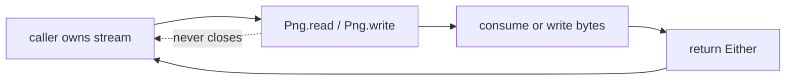
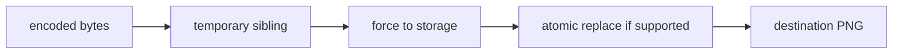

# I/O and Resource Contracts

## Goal

Make ownership, limits, and partial failure behavior part of the API.

Arrays suit tests and small assets. Streams integrate with HTTP bodies, archives, and pipelines.
Paths should protect existing files during replacement.

```scala
Png.decode(bytes)
Png.read(inputStream, limits)
Png.read(path, limits)
Png.write(outputStream, image)
Png.write(path, image)
```

Caller-owned streams are never closed. Output streams are flushed after success. The bounded reader
checks total bytes after every buffer and stops immediately after crossing `maximumFileBytes`.



## Transactional path writes

Writing directly to the destination can leave a truncated file if the process or disk fails.
`SafeFiles` writes to a temporary sibling, forces bytes through a file channel, then moves it over
the destination. A sibling stays on the same filesystem. Atomic move is preferred; same-filesystem
replacement is the explicit fallback. A `finally` block removes temporary files on failure.



## Limits are caller policy

`DecoderOptions` independently bounds compressed bytes, chunk count, individual chunk bytes, width,
height, total pixels, and inflated bytes. Separate bounds matter: a small file can declare extreme
dimensions, contain thousands of tiny chunks, or expand into a huge uniform raster.

## Strict zlib completion

The inflater accepts exactly one complete zlib stream. It rejects truncation, preset dictionaries,
output beyond the derived bound, extra compressed bytes, and a no-progress state. Catching only
`DataFormatException` is insufficient because incomplete or concatenated inputs require explicit
inflater-state checks.
