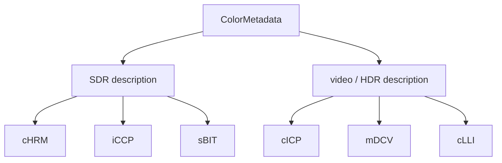

# Color Numbers Are Not Yet Appearance

An RGB pixel such as `(255, 0, 0)` says “maximum red channel,” but it does not completely specify
which physical red a display should produce. Color-space metadata connects stored numbers to
measured light and standardized viewing systems.

## cHRM: chromaticities

cHRM stores x/y coordinates for the white point and RGB primaries. Each coordinate is an unsigned
integer divided by 100000. `Chromaticity` validates finite encoded values; `Chromaticities` keeps
the four points named so callers cannot exchange red and white accidentally.

## iCCP: an embedded ICC profile

iCCP contains a Latin-1 name, compression method zero, and a zlib-compressed ICC profile.
`IccProfile` clones bytes at construction and access. Decoding applies a 64 MiB expansion limit and
the same strict zlib completion checks used by image data.

## sBIT: original precision

sBIT records how many source bits were meaningful. Its length depends on color type: one for
grayscale, three for RGB/indexed, two for grayscale-alpha, and four for RGBA. Values must be positive
and may not exceed the relevant storage depth.

## HDR-oriented Third Edition chunks

- **cICP**: primaries, transfer function, matrix coefficients, and full-range flag;
- **mDCV**: mastering-display primaries, white point, and luminance extrema;
- **cLLI**: maximum content and frame-average light levels.

Parsing metadata is not the same as applying a color transform. The codec exposes validated values
and profile bytes; it does not claim to convert between ICC spaces or tone-map for a particular
display. Those operations need a color-management engine and an output-device profile.

