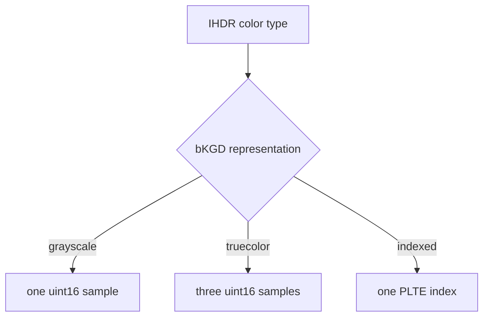

# Backgrounds, Histograms, Suggested Palettes, and Compressed Text

These chunks are “optional,” but their byte layout often depends on IHDR or PLTE. Parsing them as
context-free blobs loses the most important validation rules.

## bKGD follows the color type

`BackgroundColor` is an enum with those three cases. The indexed form must point inside PLTE; the
sample forms must fit the current bit depth. Re-encoding an indexed background into the library's
RGBA output is rejected unless the caller explicitly converts it to a truecolor background.

## hIST belongs to PLTE

hIST is legal only for indexed color and contains exactly one unsigned 16-bit frequency per PLTE
entry. A length that is even but does not equal the palette size is still invalid.

## sPLT is independent of the image palette

sPLT is a suggested palette for viewers with limited color capabilities. Multiple chunks are
allowed, but names must be unique. Each chunk declares sample depth 8 or 16, which selects entry
width. `SuggestedPaletteEntry` retains RGBA channels and a 16-bit usage frequency.

## zTXt compresses Latin-1 text

zTXt uses the same keyword rules as tEXt, followed by compression method zero and a zlib stream.
The decoder applies a separate 16 MiB text expansion boundary and validates complete zlib
termination. `CompressedText` preserves the caller's request to emit zTXt rather than tEXt.

