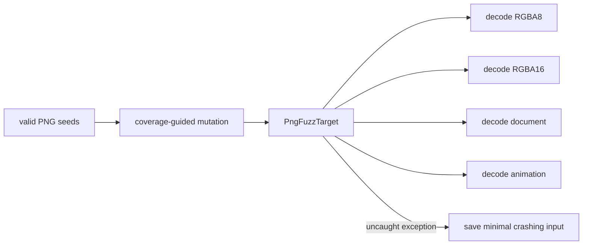

# Fuzzing and Benchmarking Without Fooling Yourself

Correctness and speed are different questions:

- **fuzzing** asks whether an unexpected byte sequence can crash or escape a resource contract;
- **benchmarking** asks how much work a known valid operation performs per unit of time.

Neither replaces ordinary tests. They explore different failure modes.

## A fuzz target is a very small API

Jazzer expects a public static `fuzzerTestOneInput(byte[])` method. `PngFuzzTarget` passes the same
input to RGBA8, lossless RGBA16, document metadata, and APNG decoding. Each call uses deliberately
small limits for file size, chunks, dimensions, pixels, and inflated bytes.



Invalid signatures, CRCs, lengths, and ordering are ordinary `Left(PngError)` results. The target
does not treat those as crashes and does not catch unexpected exceptions. This distinction gives the
fuzzer a useful signal instead of reporting every malformed file as a bug.

The regular suite runs every PngSuite seed plus deterministic bit mutations. That is a quick
regression gate, not coverage-guided fuzzing. For a real campaign, install the
[Jazzer standalone binary](https://github.com/CodeIntelligenceTesting/jazzer), then build an assembly
and use the checked-in corpus:

```console
scala-cli --power package . --assembly --force \
  --main-class png.PngCli -o target/learn-png-fuzz.jar

jazzer --cp=target/learn-png-fuzz.jar \
  --target_class=png.PngFuzzTarget \
  --instrumentation_includes=png.** \
  testdata/pngsuite -max_len=1048576
```

Always add a discovered crashing input to a permanent regression corpus before fixing the bug.

## Benchmark four separate questions

Run the quick smoke configuration:

```console
scala-cli run . --main-class png.PngBenchmark -- --quick
```

Omit `--quick` for longer local samples. The harness separately reports RGBA8 decode, RGBA16 decode,
RGBA8 encode, and RGBA16 encode. `ns/op` is latency; `MiB/s` divides logical uncompressed pixel bytes
by that latency. It does not use compressed file size, because compression ratio would make two
identically fast codecs appear different.

The harness warms up the JVM, executes batches, and consumes results so the optimizer cannot simply
discard the work. Still, it is intentionally smaller than JMH: it does not isolate forks, measure
allocation, pin CPU frequency, or provide statistical confidence intervals. Use it to investigate a
suspected regression, not to publish universal performance claims.

## A defensible comparison checklist

1. Use the same commit, JDK, machine, power mode, image, and arguments.
2. Close unrelated CPU-heavy programs.
3. Run both versions several times and retain every result.
4. Profile before changing code; throughput says *that* something changed, not *why*.
5. Treat a single faster number as noise until repeated measurements support it.

The benchmark test checks only that every operation executes and returns finite positive values.
CI deliberately does not assert a speed threshold because shared runners are noisy.
