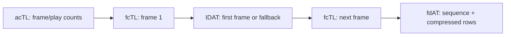
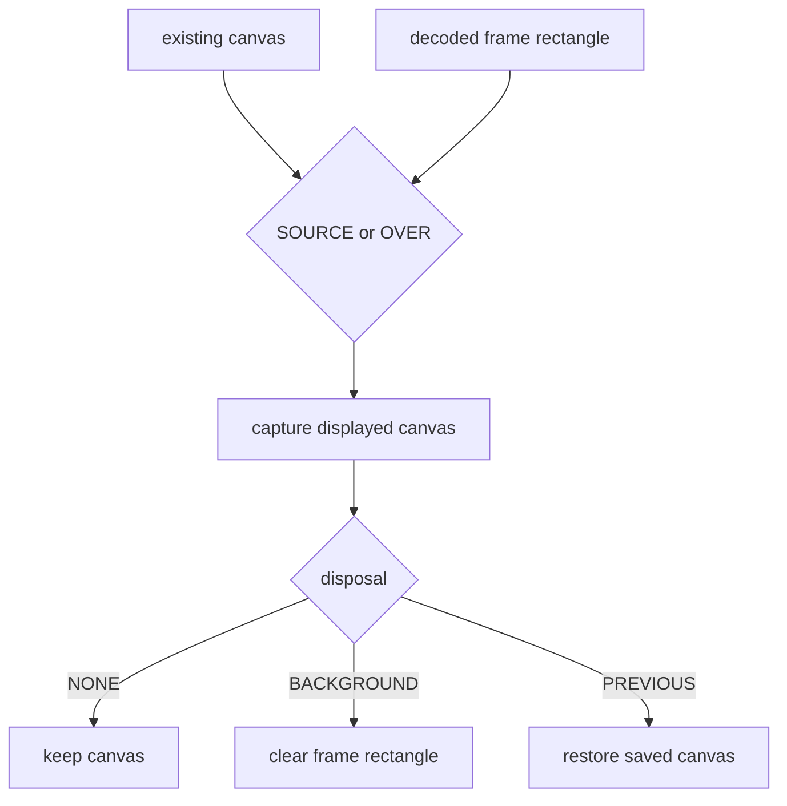

# APNG: Frames Are Rectangles on a Canvas

APNG keeps an ordinary PNG static image for non-animation-aware readers, then adds animation chunks.

Each fcTL describes a rectangle inside the IHDR canvas, a display delay, a disposal operation, and
a blend operation. Sequence numbers across fcTL and fdAT start at zero and increase without gaps.

## Decode frames with the static codec

Frame compressed bytes use the same color type, bit depth, palette, transparency, filters, and
interlace method as the static PNG. The APNG decoder constructs a validated frame header and reuses
the lossless `Codec16` path rather than maintaining a second sample decoder.

## Blend before disposal

SOURCE replaces canvas pixels. OVER performs straight-alpha composition in 16-bit integer
arithmetic. The displayed frame is captured after blending and before disposal.

The first frame may not use PREVIOUS because no earlier canvas state exists. A zero delay denominator
means 100, as required by APNG, rather than division by zero.

## Public result

`Png.decodeAnimation` returns `PngAnimation`: canvas dimensions, play count, composed `Image16`
frames, static fallback, and whether that fallback participates as the first animation frame.

